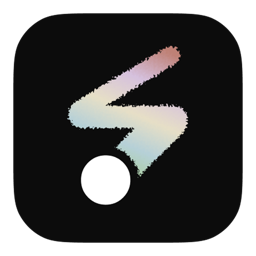

# Paint application

A Paint Electron lightweight application

## Features

### Advanced Drawing Tools

Smooth brush with quadratic curves <br>
Texture brush with bristle simulation<br>
Variable brush sizes with real-time preview<br>
Color picker with HSV controls<br>

### Canvas Management

Infinite canvas with pan & zoom (0.95x - 10x)<br>
Grid overlay for precision drawing<br>
High-DPI display support<br>
Auto-save progress to localStorage<br>

### Sticky Notes System

Triple-click to create sticky notes<br>
Drag & drop positioning<br>
Double-click to edit text<br>
Integrated with undo/redo system<br>

### Performance Optimizations

Document fragment for DOM updates<br>
Separate drawing/preview canvases<br>
Optimized redraw with requestAnimationFrame<br>
Memory-efficient history management (20 states)<br>

### Undo/Redo System

Full canvas state restoration<br>
Sticky notes preservation<br>
Smart timestamp-based merging<br>
Keyboard shortcuts (Ctrl+Z, Ctrl+Y)<br>

### Export & Save

Multiple formats: PNG, JPG, WebP<br>
High-quality export with background<br>
Project save/load with sticky notes<br>
Auto-save on every action<br>

### Keyboard Shortcuts

Drawing: Ctrl+Z (undo), Ctrl+Y (redo)<br>
View: Ctrl+Plus (zoom in), Ctrl+Minus (zoom out), Ctrl+0 (reset)<br>
Actions: Ctrl+C (clear), Ctrl+S (save), Ctrl+Shift+S (export)<br>

### Cross-Platform Support

Touch events for mobile/tablet<br>
Platform-specific styling (Mac/Windows)<br>
Electron IPC integration<br>
Context menu support<br>

### UI/UX Features

Color picker with live preview<br>
Brush size indicator<br>
Loading states and error handling<br>
Dark/light theme adaptation<br>

## HTML Data flow structure

## Process

1. Load JSON -> `Fetch('./data.json');`
2. Create DOM -> Create HTML Elements from JSON
3. Connect Logic -> Call `initializePaint(data)`

## UI Elements

### 1. Navigation Links

```javascript
data.navLinks.forEach((link) => {
    const li = document.createElement("li");
    if (link.isCurrent) li.id = "CurrentPage"; // Current page
    const a = document.createElement("a");

    a.href = link.href;
    a.textContent = link.text;
    // Create menu
});
```

### 2. Toolbar Controls

```javascript
switch (controlInfo.type) {
    case "color-picker":    // Picker
    case "range":           // Slide bar
    case "select":          // Dropdown menu
}
```

### 3. Buttons

```javascript
// Fetch from JSON file
toolbarData.buttons.forEach((buttonInfo) => {
    const button = document.createElement("button");
    button.id = buttonInfo.id;
    button.textContent = buttonInfo.text;
});
```
